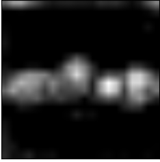
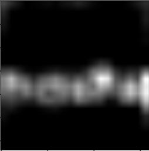
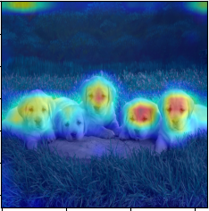
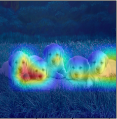
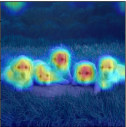
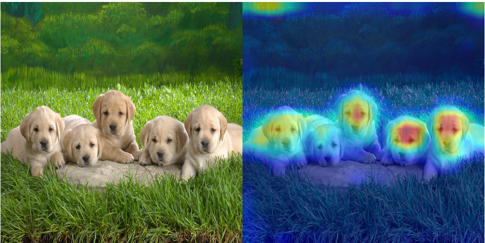
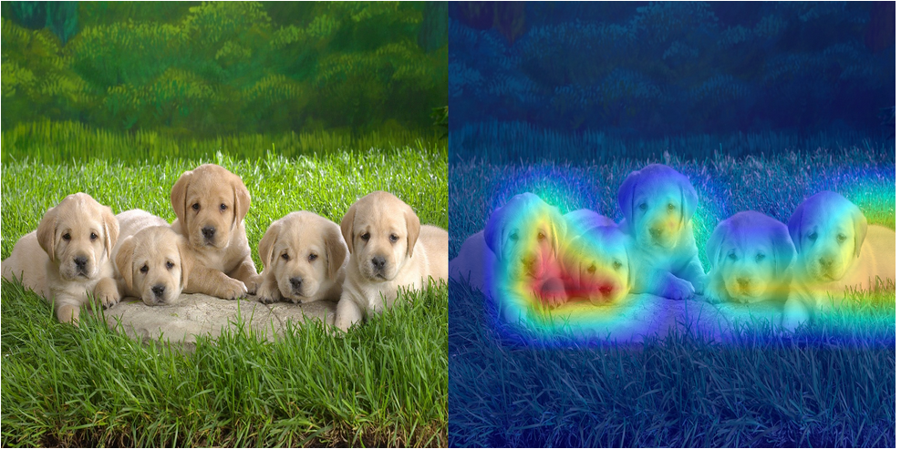

# EigenCAM for YOLO V11 Interpretability

A package for applying EigenCAM and generating heatmaps for the new YOLO V11 model. Simply clone the package and import the modules to get started.

The basic structure is close to [Jacob Gil&#39;s package for AI explainability](https://github.com/jacobgil/pytorch-grad-cam) and modified to be used for the YOLO V11 model.

## Use Cases

It can be used on YOLO V11 classification, segmentation and object detection models. It can also be used with the older models, where all you have to do is just pass the model and see it work automatically. Example notebook for V8 and V11 provided.

You can also send pull request for adding more functions to it.

## What is EigenCAM

EigenCAM is a technique that involves computing the first principle component of the 2D activations in a neural network, without taking class discrimination into account, and has been found to produce effective results.

#### Image:


#### GrayScale Heatmaps:

| Object Detection         | Classification             | Segmentation               |
| ------------------------ | -------------------------- | -------------------------- |
|  |  |  |

#### Combined

| Object Detection         | Classification             | Segmentation               |
| ------------------------ | -------------------------- | -------------------------- |
|  |  |  |

### Object Detection model



### Classification model



### Segmentation model


## Getting Started

#### Simply clone this repository or just download the yolo_cam folder. You must have the yolo_cam folder in the same location as your notebook

#### Import the libraries first:

```python
from yolo_cam.eigen_cam import EigenCAM
from yolo_cam.utils.image import show_cam_on_image, scale_cam_image
```

#### Call the function and print the image (tasks supported = 'od', 'cls' and 'seg')

```python
cam = EigenCAM(model, target_layers,task='cls')
grayscale_cam = cam(rgb_img)[0, :, :]
cam_image = show_cam_on_image(img, grayscale_cam, use_rgb=True)
plt.imshow(cam_image)
plt.show()
```

#### For the Object Detection Task, just change the task to 'od' and the rest is same.

```python
cam = EigenCAM(model, target_layers,task='od')
```

The default task is 'od' so it is fine even if you don't specify the task then

#### Check out the Jupyter Notebook titled YOLO v11n EigenCAM to understand it better and also handle any issues.

## ToDo:

See the [open issues](https://github.com/rigvedrs/Yolo-V8-CAM/issues) for a list of proposed features (and known issues).

- [X] Solve the issue with having to re-run the cells
- [X] Add support for segmentation model
- [ ] Add support for pose detection model
- [ ] Solve pending issues

## Contributing

The open source community thrives on contributions, making it an incredible space for learning, inspiration, and creativity. Please feel free to share any contributions you have for this project.

- Create your Feature Branch (`git checkout -b feature/CoolFeature`)
- Commit your Changes (`git commit -m 'Add some CoolFeature'`)
- Push to the Branch (`git push origin feature/CoolFeature`)
- Open a Pull Request

## License

Distributed under the MIT License. See `LICENSE` for more information.

## Contact

[](mailto:rigvedrs@gmail.com)

[](https://www.linkedin.com/in/rigvedrs/)
